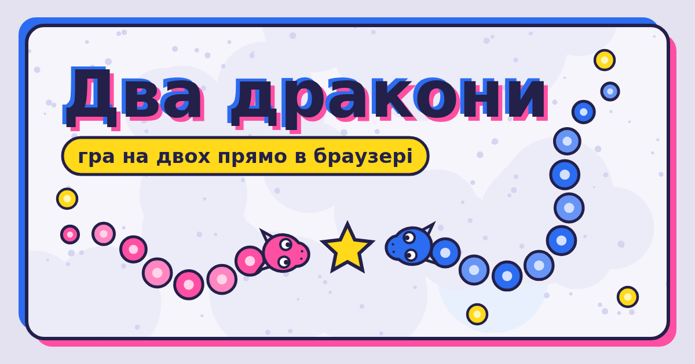

<div align="center">

# 🎲 Ігротека

**Наша маленька бібліотека ігор у браузері. Вхід лише за паролем, усе зашифровано.**

[Відкрити](https://sstepanchuk.github.io/drakony/) · [🐉 Два дракони](https://sstepanchuk.github.io/drakony/dragons/)

</div>

<p align="center"></p>

## Ігри

| | Гра | |
|---|---|---|
| 🐉 | **Два дракони** | Гра на двох за посиланням: збирай шматочки, рости й обжени іншого дракона. |

## Як це працює

- Репозиторій публічний, але ігри й їхній код лежать тут **лише зашифрованими** (AES-256-GCM).
- У кожної людини **свій пароль** і своя пара ключів (ECDH P-256). Пароль відмикає твій приватний ключ, а він — ключ бібліотеки.
- Людину можна додати чи прибрати, не знаючи чужих паролів. Після видалення ключ бібліотеки змінюється, і все перешифровується.
- Браузер запам'ятовує ключ так, що його не можна витягти, тож пароль вводиш один раз на пристрої. Сам пароль не зберігається.
- У кожної гри своє посилання з власною карткою для Telegram. Картку видно всім, саму гру — лише після входу.

## Будова

```
site/          сайт, який публікує GitHub Pages
  index.html     полиця з іграми
  <гра>/         відкрита сторінка гри + game.bin (зашифрована гра)
  keyring.json   публічні ключі й «скриньки» з ключем бібліотеки
  lib/           шифрування й замок (працюють і в браузері, і в Node)
vault/         зашифрований вихідний код ігор
games/         відкритий код (лише локально, в .gitignore)
tools/cli.js   збирання, шифрування, керування людьми
```

## Команди

```sh
npm install
npm run unlock               # розшифрувати код ігор у games/
npm run dev                  # http://localhost:8000/dragons/ — гра з вихідних файлів
npm run build                # зібрати, зашифрувати, оновити site/ і vault/

npm run user -- list         # хто має доступ
npm run user -- add Оля      # додати людину (пароль створиться й покажеться один раз)
npm run user -- remove Оля   # прибрати людину
npm run user -- passwd       # змінити свій пароль
```

Пароль можна передати змінною `VAULT_PASSWORD`.

## Нова гра

1. Тека `games/<id>/`: `index.html`, `game.json` (назва, опис, картка), `preview.png` 1200×630.
2. Скрипти — звичайні ES-модулі (`<script type="module">`), стилі — `<link rel="stylesheet">`.
   Під час збирання все вбудовується в одну сторінку й шифрується.
3. `npm run build`, коміт, пуш.

## Публікація

Після пушу в `main` сайт публікує GitHub Actions. Разово треба ввімкнути:
**Settings → Pages → Source: GitHub Actions**.
